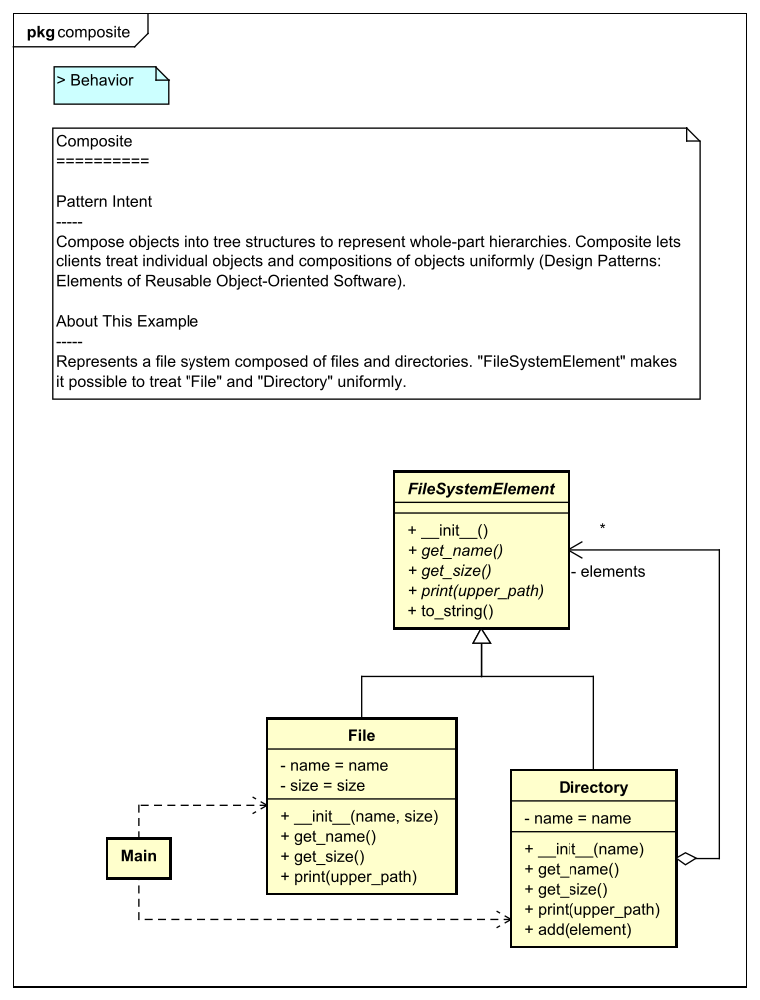
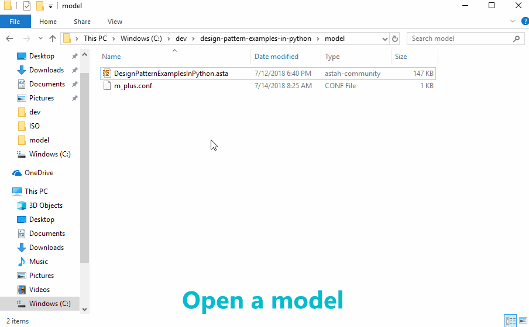

Design Pattern Examples in Python
===

Model and code examples of GoF Design Patterns for Python.  
This project is available for the following objectives:  

* To try Model-Driven Development (MDD) using Astah and M PLUS plug-in.
* To understand the mapping between UML model and Python code.
* To understand GoF Design Pattern examples in Python.  
  etc.

> UML model example:



> Python code example:

```python:File class
#!/usr/bin/env python
# -*- coding: utf-8 -*-
# ˅
from structural_patterns.composite.file_system_element import FileSystemElement

# ˄


class File(FileSystemElement):
    # ˅

    # ˄

    def __init__(self, name, size):
        # ˅
        super().__init__(name, size)
        # ˄

    # Print this element with the "upperPath".
    def print(self, upper_path):
        # ˅
        print(upper_path + '/' + self.to_string())
        # ˄

    # ˅

    # ˄


# ˅

# ˄
```

Installation
------------
**Astah**
* Download Astah UML or Professional from [Change Vision site](http://astah.net/download), and install.  

**M PLUS plug-in**
* Download the plug-in from [M PLUS plug-in site](https://sites.google.com/view/m-plus-plugin/download), and install.  
  Use **ver.2.1** or higher.

**Development Environment for Python**
* Prepare an arbitrary development environment for Python (e.g. [PyCharm](https://www.jetbrains.com/pycharm/download/), [Eclipse](http://www.eclipse.org/downloads/eclipse-packages/)).
* **Tkinter** package is required. The operation has been confirmed in **Python 3.7.0**.

Usage
-----
1. Select model elements on the model browser of Astah.
2. Click the **Generate code** button.  
   The generated code has **User Code Area**. The User Code Area is the area enclosed by "˅" and "˄". Handwritten code written in the User Code Area remains after a re-generation.
3. Run the program from **main.py** for each Design Pattern.  

For detailed usage of the tools, please see [Astah Manual](http://astah.net/manual) and [M PLUS plug-in Tips](https://sites.google.com/view/m-plus-plugin/tips).



References
----------
* Gamma, E. et al. Design Patterns: Elements of Reusable Object-Oriented Software, Addison-Wesley, 1994
* Hiroshi Yuki. Learning Design Patterns in Java [In Japanese Language], Softbank publishing, 2004

Licence
-------
This project is licensed under the Creative Commons Zero (CC0) license. The model and code are completely free to use.

[](http://creativecommons.org/publicdomain/zero/1.0/deed)
