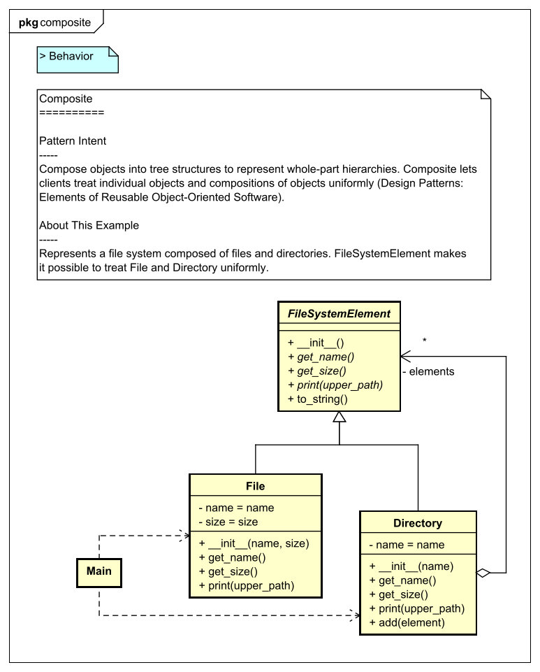

[](https://raw.githubusercontent.com/takaakit/design-pattern-examples-in-python/master/screenshots/DiagramMap.svg)

Design Pattern Examples in Python
===

Model and code examples of GoF Design Patterns for Python.  
This project is available for the following objectives:  

* To understand GoF Design Pattern examples in Python.
* To understand the mapping between UML model and Python code.
* To try Model-Driven Development (MDD) using Astah and M PLUS plug-in.

> UML model example:



<a id="code-example"></a>
> Python code example:

```python
#!/usr/bin/env python
# -*- coding: utf-8 -*-
# ˅
from structural_patterns.composite.file_system_element import FileSystemElement

# ˄


class File(FileSystemElement):
    # ˅

    # ˄

    def __init__(self, name, size):

        self.__name = name

        self.__size = size

        # ˅
        super().__init__()
        # ˄

    def get_name(self):
        # ˅
        return self.__name
        # ˄

    def get_size(self):
        # ˅
        return self.__size
        # ˄

    # Print this element with the "upper_path".
    def print(self, upper_path):
        # ˅
        print(upper_path + '/' + self.to_string())
        # ˄

    # ˅

    # ˄


# ˅

# ˄
```

Installation
------------
**UML Modeling Tool**
* Download the modeling tool [Astah](http://astah.net/download) UML or Professional, and install.  
* Download [M PLUS](https://sites.google.com/view/m-plus-plugin/download) plug-in **ver.2.1** or higher, and add it to Astah.  
  [How to add plugins to Astah](https://astahblog.com/2014/12/15/astah_plugins/)

**Python Development Environment**  
* Install Python with tkinter included. The operation has been confirmed in **Python 3.7.0**.
* Optionally, install an IDE (e.g. [PyCharm](https://www.jetbrains.com/pycharm/download/)).

Usage
-----
**Code Generation from UML**
  1. Open the Astah file (model/DesignPatternExamplesInPython.asta).
  2. Select model elements on the model browser of Astah.
  3. Click the **Generate Code** button.  
    
  The generated code has **User Code Area**. The User Code Area is the area enclosed by "˅" and "˄". Handwritten code written in the User Code Area remains after a re-generation. [View code example](#code-example).  
  For detailed usage of the tools, please see [Astah Manual](http://astah.net/manual) and [M PLUS plug-in Tips](https://sites.google.com/view/m-plus-plugin-tips).

**Run (if you use PyCharm)**
  1. Open the project root directory (design-pattern-examples-in-python) in PyCharm.
  2. Open `main.py` for the pattern you want to run, and click `Run` icon in the left gutter.
       

References
----------
* Gamma, E. et al. Design Patterns: Elements of Reusable Object-Oriented Software, Addison-Wesley, 1994
* Hiroshi Yuki. Learning Design Patterns in Java [In Japanese Language], Softbank publishing, 2004

Licence
-------
This project is licensed under the Creative Commons Zero (CC0) license. The model and code are completely free to use.

[](http://creativecommons.org/publicdomain/zero/1.0/deed)
