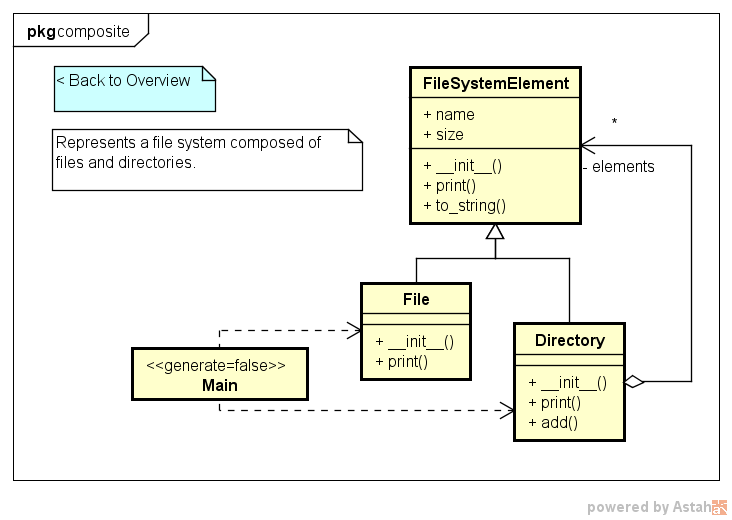
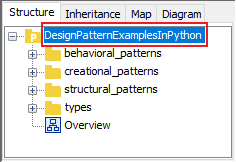
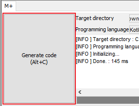

Design Pattern Examples in Python
===

[English](README.md) | 日本語

Python向けに作成したデザインパターンのモデル＆コード例です。  
次のような目的で活用ください。

* Astah と M PLUS プラグインを使ってモデル駆動開発を試す。
* UML モデルと Python コードのマッピングを知る。
* Python で記述したデザインパターンのコード例を知る。  
  など  

> UML モデル例:



> Python コード例:

```python:File class
#!/usr/bin/env python
# -*- coding: utf-8 -*-
# ˅
from structural_patterns.composite.file_system_element import FileSystemElement

# ˄


class File(FileSystemElement):
    # ˅

    # ˄

    def __init__(self, name, size):
        # ˅
        super().__init__(name, size)
        # ˄

    # Print this element with the "upperPath".
    def print(self, upper_path):
        # ˅
        print(upper_path + '/' + self.to_string())
        # ˄

    # ˅

    # ˄


# ˅

# ˄
```

インストール
------------
**Astah**
* [チェンジビジョンのサイト](http://astah.change-vision.com/ja/download.html)から Astah の UML or Professional をダウンロードしインストールしてください。  

**M PLUS プラグイン**
* [M PLUS プラグインのサイト](https://sites.google.com/view/m-plus-plugin/download)からプラグインをダウンロードしインストールしてください。  
  **バージョン 2.1 以降をダウンロードしてください。**  

**Python 開発環境**
* 任意の Python 開発環境を用意してください。[PyCharm](https://www.jetbrains.com/pycharm/download/), [Eclipse](http://www.eclipse.org/downloads/eclipse-packages/) など。
* **Tkinter** パッケージが必要です。**Python 3.7.0** で動作確認済みです。

使い方
------
* Astah のモデルブラウザ上でモデル要素を選択し、コード生成ボタンを押すとコードが生成されます。  
* 生成されたコードにはユーザコードエリアが挿入されます。ユーザコードエリアは "˅" と "˄" で挟まれた領域です。ユーザコードエリア内に書いた手書きコードは繰り返しコード生成しても維持されます。  
* パターン毎に用意した main.py からプログラムを実行できます。
* ツールの詳しい使い方は、[Astah のマニュアル](http://astah.change-vision.com/ja/manual.html)や [M PLUS の Tips](https://sites.google.com/view/m-plus-plugin/tips) を見てください。


参考文献
--------

* Gamma, E. et al. Design Patterns: Elements of Reusable Object-Oriented Software, Addison-Wesley, 1994
* 結城浩. Java 言語で学ぶデザインパターン入門. SB クリエイティブ, 2004

その他のプログラミング言語
--------------------------

* [Design Pattern Examples in C++](https://github.com/takaakit/design-pattern-examples-in-cpp)
* [Design Pattern Examples in C#](https://github.com/takaakit/design-pattern-examples-in-csharp)
* [Design Pattern Examples in Golang](https://github.com/takaakit/design-pattern-examples-in-golang)
* [Design Pattern Examples in Java](https://github.com/takaakit/design-pattern-examples-in-java)
* [Design Pattern Examples in JavaScript](https://github.com/takaakit/design-pattern-examples-in-javascript)
* [Design Pattern Examples in Kotlin](https://github.com/takaakit/design-pattern-examples-in-kotlin)
* [Design Pattern Examples in Ruby](https://github.com/takaakit/design-pattern-examples-in-ruby)
* [Design Pattern Examples in Scala](https://github.com/takaakit/design-pattern-examples-in-scala)
* [Design Pattern Examples in Swift](https://github.com/takaakit/design-pattern-examples-in-swift)
* [Design Pattern Examples in TypeScript](https://github.com/takaakit/design-pattern-examples-in-typescript)

Contributing
----
We welcome your contributions. Function addition, bug fix, refactoring, etc.  
The procedure is as follows.

1. Fork the repository and create your branch from master.
2. If you've changed model or code, check that the model and code are not separate. The check procedure is as follows.
    1. Select a project element on the model browser of Astah.  
    
    2. Press the "Generate code" button.  
    
    3. Check that the generated code is not updated.  
    
3. Issue the pull request!

Licence
----------
このプロジェクトは Creative Commons Zero（CC0）ライセンスです。モデルとコードは自由に使用できます。

[](http://creativecommons.org/publicdomain/zero/1.0/deed.ja)
